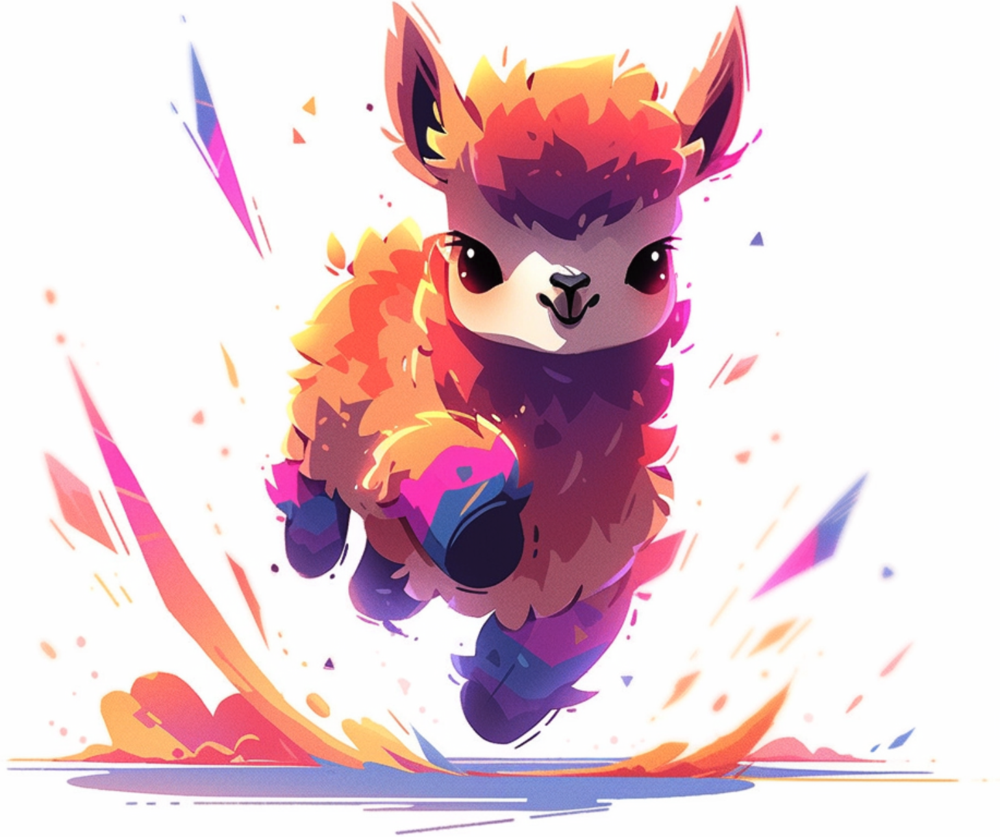
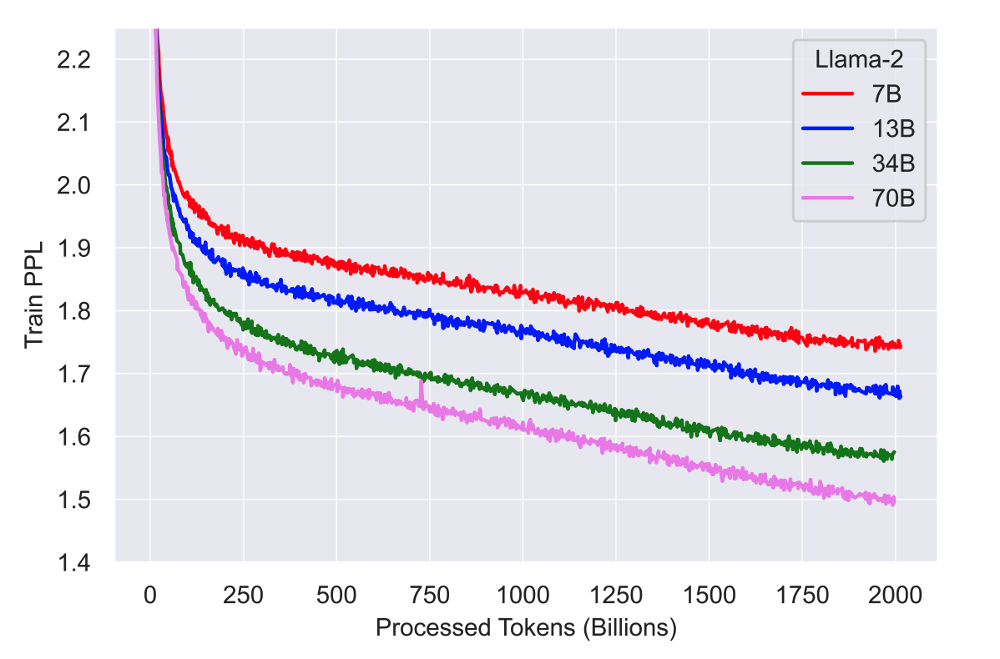

<div align="center">

# TinyLlama-1.1B
English | [中文](README_zh-CN.md)

[Chat Demo](https://huggingface.co/spaces/TinyLlama/tinyllama-chat) | [Discord](https://discord.gg/74Wcx4j5Nb)
</div>

The TinyLlama project aims to **pretrain** a **1.1B Llama model on 3 trillion tokens**. With some proper optimization, we can achieve this within a span of "just" 90 days using 16 A100-40G GPUs 🚀🚀. The training has started on 2023-09-01. 

<div align="center">
  
</div>

We adopted exactly the same architecture and tokenizer as Llama 2. This means TinyLlama can be plugged and played in many open-source projects built upon Llama. Besides, TinyLlama is compact with only 1.1B parameters. This compactness allows it to cater to a multitude of applications demanding a restricted computation and memory footprint.

#### News
- 2023-12-18： Add two notes [1](https://whimsical-aphid-86d.notion.site/Release-of-TinyLlama-1-5T-Checkpoints-Postponed-01b266998c1c47f78f5ae1520196d194?pvs=4), [2](https://whimsical-aphid-86d.notion.site/Latest-Updates-from-TinyLlama-Team-7d30c01fff794da28ccc952f327c8d4f?pvs=4) explaining the changes of training curves, project schedules, and bug fixes.
- 2023-10-03: Add examples in speculative decoding with llama.cpp. Do check out the [speculative_decoding/README.md](speculative_decoding/README.md).
- 2023-10-02: 1. 1T-token checkpoint just dropped. 2. We document **all** intermediate checkpoints [here](https://huggingface.co/TinyLlama/tinyLlama-intermediate-checkpoints/tree/step-480k-token-1007B).
- 2023-09-28: Add a discord server.
- 2023-09-18: 1. We added a [chat demo](https://huggingface.co/spaces/PY007/TinyLlama-Chat) so that you can play with TinyLlama-Chat-V0.1 right away. 
- 2023-09-16: 1. We released the intermediate checkpoint trained on 503B tokens. 2. We released a chat model finetuned on OpenAssisant and simple [finetuning](sft) scripts is added. 3. More eval benchmarks are added and documented in [EVAL.md](EVAL.md). 

#### Evaluation
You can find the evaluation results of TinyLlama in [EVAL.md](EVAL.md).

#### Releases Schedule
We will be rolling out intermediate checkpoints following the below schedule. 

Base models:

| Date       | HF Checkpoint                                   | Tokens | Step | Commonsense Avg |
|------------|-------------------------------------------------|--------|------| --------------- |
| 2023-09-01 | Pythia-1.0B                                     | 300B   | 143k   | 48.30 |
| 2023-09-04 | [TinyLlama-1.1B-intermediate-step-50k-105b](https://huggingface.co/PY007/TinyLlama-1.1B-step-50K-105b) | 105B   | 50k   | 46.11|
| 2023-09-16 | [TinyLlama-1.1B-intermediate-step-240k-503b](https://huggingface.co/PY007/TinyLlama-1.1B-intermediate-step-240k-503b)                                            | 503B   | 240K    | 48.28 |
| 2023-10-01 | [TinyLlama-1.1B-intermediate-step-480k-1T](https://huggingface.co/PY007/TinyLlama-1.1B-intermediate-step-480k-1T) | 1T     | 480k | 50.22 |
| 2023-11-04 | [TinyLlama-1.1B-intermediate-step-715k-1.5T](https://huggingface.co/PY007/TinyLlama-1.1B-intermediate-step-715k-1.5T)                                            | 1.5T     |715k    |51.28 |
| 2023-11-20 | [TinyLlama-1.1B-intermediate-step-955k-2T](https://huggingface.co/TinyLlama/TinyLlama-1.1B-intermediate-step-955k-token-2T)                                            | 2T     |955k    |51.64 |
| 2023-12-11 | [TinyLlama-1.1B-intermediate-step-1195k-2.5T](https://huggingface.co/TinyLlama/TinyLlama-1.1B-intermediate-step-1195k-token-2.5T)              | 2.5T     | 1195k    |53.86 |
| 2023-12-28 | [TinyLlama-1.1B-intermediate-step-1431k-3T](https://huggingface.co/TinyLlama/TinyLlama-1.1B-intermediate-step-1431k-3T)              | 3T   | 1431k  | 52.99 |

We are crafting a note offering possible explaination on why there is a significant improvement from 2T to 2.5T checkpoint (It is related to [bos_id issue](https://github.com/jzhang38/TinyLlama/issues/83))

Chat models:

| Date       | HF Checkpoint                                   | Tokens | Step | Commonsense Avg |
|------------|-------------------------------------------------|--------|------| --------------- |
| 2023-09-16 | [TinyLlama-1.1B-Chat-V0.1](https://huggingface.co/PY007/TinyLlama-1.1B-Chat-v0.1)                                            | 503B   | 240K    |  49.57 |
| 2023-10-1 | [TinyLlama-1.1B-Chat-V0.3](https://huggingface.co/PY007/TinyLlama-1.1B-Chat-v0.3)                                            | 1T   | 480K    |  51.36 |
| 2023-11-04 | [TinyLlama-1.1B-Chat-V0.4](https://huggingface.co/TinyLlama/TinyLlama-1.1B-Chat-v0.4)                                            | 1.5T   | 715K    |  52.30 |

Note that the learning rate of the base model has not cooled down yet so we recommend you to also use the finetuned chat model.

Meanwhile, you can track the live cross entropy loss [here](https://wandb.ai/lance777/lightning_logs/reports/metric-train_loss-23-09-04-23-38-15---Vmlldzo1MzA4MzIw?accessToken=5eu2sndit2mo6eqls8h38sklcgfwt660ek1f2czlgtqjv2c6tida47qm1oty8ik9).

## Potential Usecase
Tiny but strong language models are useful for many applications. Here are some potential usecases:
- Assisting speculative decoding of larger models. (See this [tutorial](https://twitter.com/karpathy/status/1697318534555336961) by Andrej Karpathy)
- Deployment on edge devices with restricted memory and computational capacities, for functionalities like real-time machine translation without an internet connection (the 4bit-quantized TinyLlama-1.1B's weight only takes up 637 MB).
- Enabling real-time dialogue generation in video games.

Moreover, our code can be a **reference for enthusiasts keen on pretraining language models under 5 billion parameters** without diving too early into [Megatron-LM](https://github.com/NVIDIA/Megatron-LM).

## Training Details
Below are some details of our training setup:

| Setting                         | Description                                                    |
|---------------------------------|----------------------------------------------------------------|
| Parameters                      | 1.1B                                                           |
| Attention Variant               | Grouped Query Attention                                        |
| Model Size                      | Layers: 22, Heads: 32, Query Groups: 4, Embedding Size: 2048, Intermediate Size (Swiglu): 5632|
| Sequence Length                 | 2048                                                           |
| Batch Size                      | 2 million tokens (2048 * 1024)                                             |
| Learning Rate                   | 4e-4                                                           |
| Learning Rate Schedule          | Cosine with 2000 warmup steps. See [Issue 27](https://github.com/jzhang38/TinyLlama/issues/27) for a minor bug     |
| Training Data                   | [Slimpajama](https://huggingface.co/datasets/cerebras/slimpajama-627b) & [Starcoderdata](https://huggingface.co/datasets/bigcode/starcoderdata) |
| Data Preprocessing              | Excluded GitHub subset of Slimpajama; Sampled all code from Starcoderdata |
| Combined Dataset Size           | Around 950B tokens                                              |
| Total Tokens During Training    | 3 trillion (slightly more than 3 epochs/1430k steps)                                          |
| Natural Language to Code Ratio  | 7:3                                                            |
| Hardware                        | 16 A100-40G GPUs                                               |


## Blazingly Fast
Our codebase supports the following features:
- multi-gpu and multi-node distributed training with FSDP.
- flash attention 2.
- fused layernorm.
- fused swiglu.
- fused cross entropy loss .
- fused rotary positional embedding.

Credit: flash attention 2, fused layernorm, fused cross entropy loss, and fused
rotary positional embedding are from the [FlashAttention repo](https://github.com/Dao-AILab/flash-attention/). Fused swiglu is from [xformers](https://github.com/facebookresearch/xformers).

Thanks to those optimizations, we achieve a throughput of **24k** tokens per second per A100-40G GPU, which translates to **56% model flops utilization** without activation checkpointing (We expect the MFU to be even higher on A100-80G). It means you can train a chinchilla-optimal TinyLlama (1.1B param, 22B tokens) in **32 hours with 8 A100**. Those optimizations also greatly reduce the memory footprint, allowing us to stuff our 1.1B model into 40GB GPU RAM and train with a per-gpu batch size of 16k tokens. **You can also pretrain TinyLlama on 3090/4090 GPUs with a smaller per-gpu batch size**.
Below is a comparison of the training speed of our codebase with that of Pythia and MPT.


| Model                             | A100 GPU hours taken on 300B tokens| 
|-----------------------------------|------------------------------------|
|TinyLlama-1.1B                     | 3456                               |    
|[Pythia-1.0B](https://huggingface.co/EleutherAI/pythia-1b)                        | 4830                               |
|[MPT-1.3B](https://huggingface.co/mosaicml/mpt-1b-redpajama-200b)                           | 7920                               |  

<small> The Pythia number comes from their [paper](https://arxiv.org/abs/2304.01373). The MPT number comes from [here](https://huggingface.co/mosaicml/mpt-1b-redpajama-200b), in which they say MPT-1.3B " was trained on 440 A100-40GBs for about half a day" on 200B tokens. </small>

The fact that TinyLlama is a relatively small model with grouped query attention means it is also fast during inference. Below are some throughputs that we measure:

| Framework | Device | Settings | Throughput (tokens/sec) |
|-----------|--------------|-----|-----------|
|[Llama.cpp](https://github.com/ggerganov/llama.cpp) | Mac M2 16GB RAM         |  batch_size=1; 4-bit inference|    71.8     | 
|[vLLM](https://github.com/vllm-project/vllm)       | A40 GPU  | batch_size=100, n=10 |   7094.5         |


## Pretrain
Please refer to [PRETRAIN.md](PRETRAIN.md) for instructions on how to pretrain TinyLlama.

## Finetune
We include a simple full-parameter finetuning & inference script in [sft](sft). Our V0.1 chat model is finetuned using this script. The FT dataset we use is [openassistant-guanaco](https://huggingface.co/datasets/timdettmers/openassistant-guanaco). 
For finetuning with less than 4GB RAM, we refer you to the [Qlora](https://github.com/artidoro/qlora) and [bitsandbytes](https://github.com/TimDettmers/bitsandbytes) repos.
We did not undergo extensive hyperparameter tuning nor choose more performant FT datasets. We hope the community can explore on finetuning TinyLlama and come up with better chat models. I will include community-finetuned models in this repo.

## TODO
This project is still under active development. We are a really small team. Community feedback and contributions are highly appreciated. Here are some things we plan to work on:
 - [ ] Add scripts for pretraining on other datasets.
 - [ ] Sequence length extrapolation.
 - [ ] Test out speculative decoding for Llama-2-7B.
 - [ ] Test the throughput on RTX 3090/4090. 
 - [ ] Add fine-tuning scripts.
 - [ ] Properly evaluate the model on downstream tasks.
 - [ ] A demo running on mobile phones. 
 - [ ] Explore retrieval-augmentation.


## Acknowledgements
This repository is built upon [lit-gpt](https://github.com/Lightning-AI/lit-gpt) and [flash-attention](https://github.com/Dao-AILab/flash-attention). Be sure to explore this fantastic open-source project if it's new to you!
```
@online{lit-gpt,
  author    = {Lightning AI},
  title     = {Lit-GPT},
  url       = {https://github.com/Lightning-AI/lit-gpt},
  year      = {2023},
}
@article{dao2023flashattention2,
  title     ={Flash{A}ttention-2: Faster Attention with Better Parallelism and Work Partitioning},
  author    ={Dao, Tri},
  year      ={2023}
}
```

## Citation
This project is currently contributed by [Peiyuan Zhang](https://veiled-texture-20c.notion.site/Peiyuan-Zhang-ab24b48621c9491db767a76df860873a?pvs=4) *, [Guangtao Zeng](https://github.com/ChaosCodes) *, [Tianduo Wang](https://github.com/TianduoWang) and [Wei Lu](https://istd.sutd.edu.sg/people/faculty/lu-wei/) from the StatNLP Research Group of Singapore University of Technology and Design. 

If you find our work valuable, please cite:

```
@misc{zhang2024tinyllama,
      title={TinyLlama: An Open-Source Small Language Model}, 
      author={Peiyuan Zhang and Guangtao Zeng and Tianduo Wang and Wei Lu},
      year={2024},
      eprint={2401.02385},
      archivePrefix={arXiv},
      primaryClass={cs.CL}
}
```

## Frequently Asked Questions

#### 1. Why would pretraining a 1.1B model for so long make sense? Doesn't it contradict the Chinchilla Scaling Law?



Above is the training loss curve taken from the Llama 2 paper. Here I quote from that paper: "We observe that after pretraining on 2T Tokens, the models still did not show any sign of saturation". That is why we believe pretraining a 1.1B model for 3T tokens is a reasonable thing to do. Even if the loss curve does not go down eventually, we can still study the phenomenon of saturation and learn something from it.

#### 2. What does "saturation" mean?


The figure from the Pythia paper displays the LAMBADA accuracy plotted against the total training tokens (300B). The term "saturation" pertains specifically to the 70M and 160M models. Notably, even the 410M model does not saturate with 300B tokens, as it continues to show an increasing trend, similar to the trend of larger models. 


## Star History

[](https://star-history.com/#jzhang38/TinyLlama&Date)

